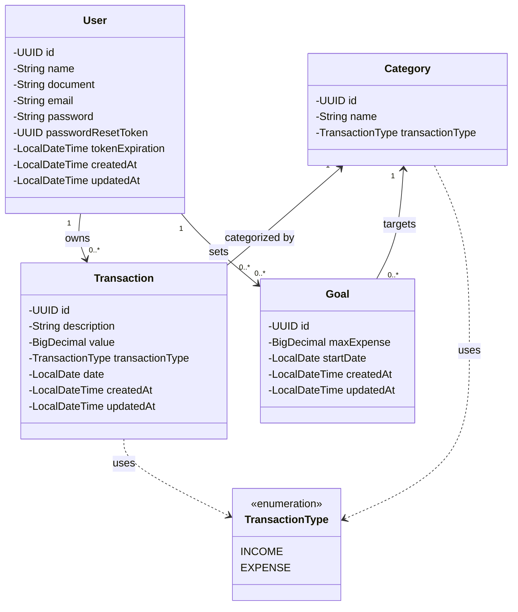

# Money Tracker App 💰

O **Money Tracker App** é uma aplicação web completa para gestão de finanças pessoais. A plataforma permite que usuários registrem suas receitas e despesas, categorizem transações, definam metas financeiras e visualizem a saúde financeira através de um dashboard intuitivo com gráficos dinâmicos.

Este projeto foi desenvolvido como parte de um portfólio profissional, demonstrando a aplicação prática de conhecimentos em desenvolvimento Java, abrangendo:

* **Clean Architecture:** Na estruturação desacoplada entre regras de negócio e frameworks.
* **Server-Side Rendering (SSR):** Utilização do Thymeleaf para gerar interfaces dinâmicas no servidor.
* **Spring Security:** Implementação de autenticação, autorização e proteção de dados.
* **Data Visualization:** Integração com bibliotecas gráficas para análise de dados.

## 🖼️ Demonstração da Interface

### 🔹 Landing Page


### 🔹 Dashboard


### 🔹 Transações


### 🔹 Metas Financeiras


## 🏗️ Arquitetura

O projeto foi estruturado seguindo princípios da **Clean Architecture**, adaptados de forma pragmática para aproveitar recursos do Spring Boot e Lombok na camada de aplicação, sem sacrificar o desacoplamento das regras de negócio.

A organização dos pacotes visa separar claramente a responsabilidade de cada componente:

### 📦 `domain`
O núcleo da aplicação. Contém apenas **POJOs** (Plain Old Java Objects) representando as Entidades e Enums.
* **Foco:** Representar o estado e as regras fundamentais do negócio, sem dependência de frameworks.

### 📦 `application`
A camada de orquestração e regras de aplicação.
* **`gateway`**: Interfaces que definem contratos para serviços externos (Repositórios, Encoder, E-mail).
* **`dto`**: Objetos de transferência de dados (Inputs/Outputs) e Records.
* **`mapper`**: Utilitários para converter Entidades de Domínio em Outputs de visualização.
* **`usecase` (Write Model):** Métodos que alteram o estado do sistema (Criar, Atualizar, Excluir). Regras de negócio e validações fortes residem aqui.
* **`query` (Read Model):** Métodos focados exclusivamente na busca de dados para renderização das páginas, permitindo otimizações de leitura.

### 📦 `infra`
A camada que implementa os detalhes técnicos e conecta a aplicação ao mundo externo.
* **`web`**: Controllers, Forms e Validadores.
* **`persistence`**: Implementação JPA/Hibernate, Entidades de Banco e Repositórios.
* **`security`**: Configurações de segurança e autenticação.

### 📂 `resources`
Scripts de migração (**Flyway**), templates HTML (**Thymeleaf**) e arquivos estáticos.

## ⚙️ Funcionalidades

O **Money Tracker App** oferece um conjunto de ferramentas para controle financeiro:

* **Dashboard:** Visão geral com saldo atual, receitas vs. despesas do mês e gráficos de distribuição.
* **Transações:** Registro de Receitas e Despesas com filtragem avançada, edição e exclusão.
* **Categorias:** Organização personalizada dos lançamentos (ex: Alimentação, Transporte).
* **Metas Financeiras:** Definição de orçamentos por categoria com barra de progresso visual.
* **Segurança:** Login, cadastro, recuperação de senha (via E-mail) e gerenciamento de perfil.

## 🔗 Diagrama de Entidades



## 💻 Tecnologias Utilizadas

Abaixo estão as principais tecnologias, frameworks e bibliotecas utilizadas na construção do projeto:

| Área | Tecnologia | Versão | Descrição |
| :--- | :--- | :--- | :--- |
| **Core** | **Java** | 21 | Linguagem de programação (LTS). |
| | **Spring Boot** | 3.5.6 | Framework base para configuração e inversão de controle. |
| **Segurança** | **Spring Security** | 6.x | Autenticação, Autorização e proteção contra ataques (CSRF, etc). |
| **Persistência** | **Spring Data JPA** | - | Abstração de repositórios e acesso a dados. |
| | **MySQL** | 8.x | Banco de dados relacional principal (Produção). |
| | **H2 Database** | - | Banco de dados em memória para testes de integração rápidos. |
| | **Flyway** | - | Controle de versionamento e migração de esquema do banco de dados. |
| **Frontend** | **Thymeleaf** | 3.x | Engine de templates para renderização server-side (SSR). |
| | **Bootstrap** | 5.3 | Framework CSS para layout responsivo e componentes visuais. |
| | **Bootstrap Icons** | 1.11 | Biblioteca de ícones vetoriais. |
| | **Chart.js** | 4.x | Biblioteca JavaScript para renderização dos gráficos do dashboard. |
| **Ferramentas** | **MapStruct** | 1.6.3 | Mapeamento eficiente e performático entre Entidades e DTOs. |
| | **Lombok** | - | Redução de código boilerplate (Getters, Setters, Builders). |
| | **Spring Mail** | - | Serviço para envio de e-mails (Recuperação de senha). |
| | **Bean Validation** | - | Validação de dados de entrada nos DTOs. |
| **Testes** | **JUnit 5** | - | Framework para execução de testes unitários e de integração. |
| | **Mockito** | - | Criação de Mocks para testes unitários isolados. |
| **Infra / DevOps** | **Docker** | - | Containerização da aplicação e banco de dados. |
| | **Docker Compose** | 3.9 | Orquestração dos containers (App, Banco e Mailpit). |

## 🔬 Testes Automatizados

Para garantir a confiabilidade da aplicação e a integridade dos dados financeiros, o projeto implementa uma estratégia de testes dividida em duas camadas principais:

### 1. Testes Unitários (Camada de Aplicação)
Focam na validação das **Regras de Negócio** e dos **Casos de Uso** isoladamente.
* **Ferramentas:** JUnit 5 e Mockito.
* **O que é testado:** Verificamos se a lógica de aplicação se comporta corretamente diante de diferentes cenários, sem depender de banco de dados ou frameworks externos.

### 2. Testes de Integração (Camada de Persistência)
Focam na validação das **Consultas ao Banco de Dados** e na corretude do SQL/JPQL gerado.
* **Ferramentas:** `@DataJpaTest` e Banco H2 (Em memória).
* **O que é testado:** Verificamos se os filtros dinâmicos, paginação e agregações (somas e agrupamentos) retornam os dados esperados.

### ⚙️ Como Executar os Testes

Para rodar a suíte completa de testes (Unitários + Integração), execute o seguinte comando no terminal na raiz do projeto:

```bash
./mvnw test
```

## 🚀 Como Executar o Projeto

A maneira mais simples de rodar a aplicação é utilizando **Docker Compose**, que sobe automaticamente a aplicação, o banco de dados e um servidor de e-mail local (Mailpit).

### Pré-requisitos

* **Docker** e **Docker Compose** instalados em sua máquina.

### Passo a Passo

### 1. Clonar o Repositório
```bash
git clone https://github.com/guilherme-eira/money-tracker-app.git
cd money-tracker-app
```

### 2. Configurar Variáveis de Ambiente
O projeto utiliza um arquivo `.env` para gerenciar credenciais sensíveis.
Crie um arquivo chamado `.env` na raiz do projeto (baseado no `.env-example`) e preencha conforme o exemplo abaixo:

> **Nota:** A `DB_URL` deve apontar para `db` (nome do serviço no Docker), e não `localhost`.

```properties
# --- Configuração do Banco de Dados ---
DB_URL=jdbc:mysql://db:3306/moneytracker_db
DB_USERNAME=root
DB_PASSWORD=root

# --- Configuração do Container MySQL ---
MYSQL_DATABASE=moneytracker_db
MYSQL_USER=root
MYSQL_PASSWORD=root
MYSQL_ROOT_PASSWORD=root

# --- Segurança da Aplicação ---
REMEMBER_ME_KEY=minha-chave-secreta-segura-123
```

### 3. Subir a Aplicação
Na raiz do projeto, execute o comando para construir a imagem e subir os containers:

```bash
docker-compose up -d --build
```
*O processo de build pode levar alguns minutos na primeira execução.*

### 4. Acessar os Serviços

Uma vez que os containers estiverem rodando, você pode acessar:

- **Aplicação Principal:** http://localhost:8080
- **Mailpit (Caixa de Entrada de Teste):** http://localhost:8025 \
  *Qualquer e-mail enviado pelo sistema (recuperação de senha) será interceptado e aparecerá nesta interface.*
- **Banco de Dados:** Conecte-se via DBeaver/Workbench em `localhost:3306` com as credenciais definidas no `.env`.
